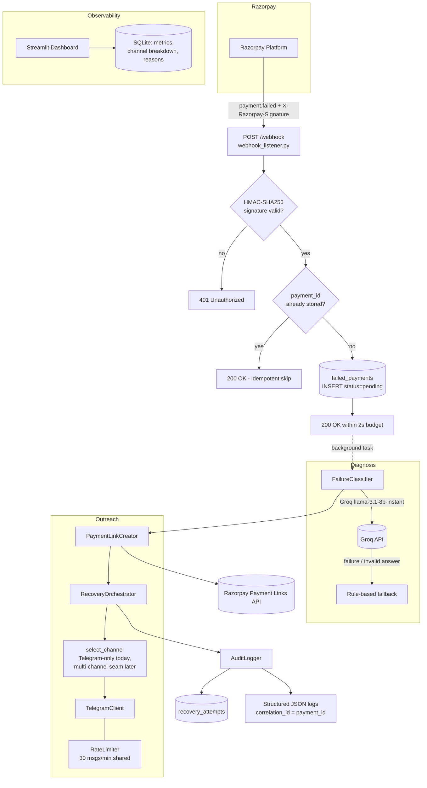

# Architecture

## System Overview



## Data Flow (per failed payment)

1. **Ingest** (`app/webhook_listener.py`)
   Raw body read *before* parsing → HMAC-SHA256 verified against
   `RAZORPAY_WEBHOOK_SECRET` → JSON parsed → `payment.failed` entity extracted.
   The `FailedPayment` row is inserted with `recovery_status="pending"` and a
   `200` is returned. Duplicate `payment_id`s short-circuit (idempotency).

2. **Diagnose** (`app/failure_classifier.py`, background task)
   Groq `llama-3.1-8b-instant` classifies the error into one of six canonical
   reasons. Any API/parse failure degrades to keyword rules, so diagnosis never
   blocks recovery.

3. **Link** (`app/payment_link_creator.py`)
   A fresh Razorpay Payment Link is created (24h expiry, SMS/email notify,
   notes carrying the original payment id + failure reason). Sync SDK call is
   wrapped in `asyncio.to_thread`, retried 3x with exponential backoff.

4. **Select channel** (`app/recovery_orchestrator.py`)
   Telegram is the only live channel today; `select_channel()` returns
   `"telegram"` and is the designated seam for future amount/reason-based
   routing.

5. **Deliver** (`app/channel_clients/telegram_client.py`)
   Personalised message with the fresh link is sent via the Telegram Bot API
   (`sendMessage`). Every send passes a shared sliding-window `RateLimiter`.
   Retries: 429/5xx and network errors are retried with backoff; permanent 4xx
   fail fast. The `FALLBACK_CHAINS` structure keeps graceful degradation
   ready for additional channels later.

6. **Audit** (`app/audit_logger.py`)
   Each outcome is persisted to `recovery_attempts` (channel, action, full
   message, outcome, link id) and mirrored into structured JSON logs
   with `correlation_id = payment_id`.

7. **Observe** (`dashboard/app.py`)
   Streamlit reads SQLite directly: recovery rate, channel breakdown, top
   failure reasons, recent attempts.

## Component Responsibilities

| Module | Responsibility | Key dependency seam |
|---|---|---|
| `config.py` | Typed env-driven settings; startup validation | — |
| `app/database.py` | Engine/session factory/FastAPI `get_db` | `DATABASE_URL` |
| `app/models.py` | ORM schema (2 tables) | SQLAlchemy |
| `app/webhook_listener.py` | Signature check, idempotency, enqueueing | `_classify_failure`, `_build_orchestrator` (test seams) |
| `app/failure_classifier.py` | LLM + rules diagnosis | injectable Groq client |
| `app/payment_link_creator.py` | Link creation w/ retries | injectable Razorpay client |
| `app/channel_clients/telegram_client.py` | Telegram Bot API delivery | injectable `httpx.AsyncClient` |
| `app/recovery_orchestrator.py` | Workflow + channel selection + delivery | all collaborators injected |
| `app/audit_logger.py` | Attempt persistence + structured logs | injected `Session` |
| `app/retry.py` *(shared util)* | Async exponential-backoff retries | injectable sleep |
| `app/logging_config.py` *(shared util)* | JSON formatter + correlation IDs | contextvar |
| `dashboard/` | Metrics UI | read-only DB access |

> Two small shared modules (`app/retry.py`, `app/logging_config.py`) were added
> beyond the base skeleton to keep retry/backoff and logging logic DRY across
> modules.

## Design Decisions

- **Fast 2xx ack:** Razorpay retries webhooks that don't respond quickly, so
  verification + one insert happen inline and everything else runs as a
  FastAPI background task with its own DB session.
- **LLM-first, rule-anchored:** classification degrades gracefully; delivery
  is single-channel today but structured around a fallback-chain abstraction.
- **Idempotency at the DB layer:** `unique(payment_id)` plus an explicit
  existence check makes replayed webhooks safe.
- **Anti-spam:** per-payment attempt cap (default 3) + process-wide sliding
  window rate limiter (default 30/min).
- **PII hygiene:** phone numbers normalised once; messages are persisted for
  audit but never logged; API keys only ever live in environment variables.

## Known Limitations / Roadmap

- **Telegram addressing:** Razorpay webhooks carry a phone number; Telegram
  needs a numeric `chat_id`. Until a phone→chat_id mapping exists (deep-link
  onboarding), `customer_contact` is passed through as `chat_id` with
  E.164→bare-digits fallback probing.
- No automatic re-attempt scheduler yet (a sweeper could re-enqueue
  `pending` rows past a cooldown — e.g. the "wait 2h for insufficient funds"
  strategy).
- In-process rate limiter; multi-replica deployments should swap in Redis.

## Closing the Loop (`payment_link.paid`)

When a customer pays a recovery link, Razorpay fires a second webhook event.
The same `POST /webhook` endpoint dispatches on `event`:

```
payment_link.paid ──▶ verify HMAC ──▶ payload.payment_link.entity
                                          │ notes.original_payment_id
                                          ▼
              FailedPayment ──▶ status = recovered
              RecoveryAttempt(channel="razorpay", action="payment_completed",
                              outcome="paid", recovery_amount=<paise>)
```

- The tie-back key is written at link-creation time by
  `PaymentLinkCreator._build_payload` (`notes.original_payment_id`).
- Idempotent: repeat paid events short-circuit when the row is already
  `recovered`.
- Demo parity: `scripts/simulate_failure.py --event payment_link.paid` and
  `scripts/batch_demo.py` emit signed paid events without touching Razorpay.
- The dashboard needs no changes — it already counts `paid` attempts and
  `recovered` statuses in its KPIs/funnel.
